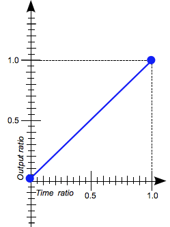
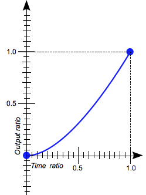
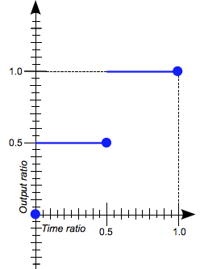
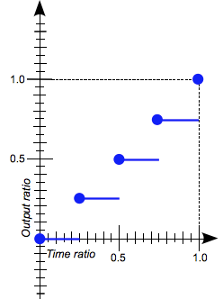

# transition 过渡动画


# 过渡
css3时代，增加了一个transition属性，用处是让变化增加过程
```css
.example {
  transition: [transition-property] [transition-duration] [transition-timing-function] [transition-delay];
}
```
我们来个简单的例子
```css
.box {
  transition: background-color 0.5s ease;
  background-color: red;
  width:100px;
  height:100px;
}
.box:hover {
  background-color: green;
}
```
可以用鼠标经过一下下面红色方块，会渐渐变成绿色；移开又会渐渐变回红色。
```html
<div class="box">&nbsp;</div>
```

# 参数
跟其他css语言类似，transition是四个属性的简写  
*如果不懂css的简写可以从基础看起，比如margin: [margin-top] [margin-right] [margin-bottom] [margin-left]*
```css
.example {
  transition: background-color 0.5s ease 200ms;
}
```
上面的属性详细的写法是下面的
```css
.example {
  transition-property: background-color;  /* 过渡属性为背景颜色 */
  transition-duration: 0.5s;  /* 过渡动画持续0.5秒 */
  transition-timing-function: ease; /* 过渡时间方法为ease缓动 */
  transition-delay: 200ms;  /* 动画延迟200毫秒执行 */
}
```
## 过渡属性
**transition-property**

1. 单一属性
```css
.example {
  transition-property: background-color;  /* 单独写一种css的属性 */
}
```


2. 属性列表，逗号分隔
```css
.example {
  transition-property: background-color, width, padding;  /* 逗号分隔的多种css的属性 */
}
```


3. 关键字，none
```css
.example {
  transition-property: none;  /* 设置为none的时候，没有缓动，可以在需要清除缓动时候做这种赋值处理 */
}
```


4. 关键字，all
```css
.example {
  transition-property: all;  /* 设置为all的时候，所有属性都有缓动，这是默认值 */
}
```


## 持续时间
**transition-duration**


动画执行的时间，默认值为0s，单位可以用s(秒)和ms(毫秒)
```css
.example {
  transition-duration: 0.5s;  /* 缓动动画间隔为0.5秒 */
}
.other {
  transition-duration: 500ms;  /* 缓动动画间隔为500毫秒(其实也就是0.5秒) */
}
```


## 延迟时间
**transition-delay**


动画延迟执行的时间，默认值为0s，单位可以用s(秒)和ms(毫秒)
```css
.example {
  transition-delay: 0.5s;  /* 缓动动画延迟0.5秒执行 */
}
.other {
  transition-delay: 500ms;  /* 缓动动画延迟500毫秒(其实也就是0.5秒)执行 */
}
```


## 过渡方式
**transition-timing-function**
### 缓动系数
* ease
* linear
* ease-in
* ease-out
* ease-in-out


缓动系数 | 图片 | 贝塞尔 | 简介
---------| ------------- | ------------- | -------------
ease  |   | 0.25, 0.1, 0.25, 1.0 | 开始加速运动，结束减速运动直至停止  
linear  |  | 0.0, 0.0, 1.0, 1.0 | 速度不变  
ease-in  |  | 0.42, 0.0, 1.0, 1.0 | 加速运动  
ease-out  |  | 0.0, 0.0, 0.58, 1.0 | 减速运动  
ease-in-out  |  | 0.42, 0.0, 0.58, 1.0 | 开始加速运动，结束减速运动直至停止。相当于ease的升级版    

-------------

可以实际写一下对比一下
```css
.spread {
  transition-property: width;
  transition-duration: 2s;
  background-color: red;
  width: 100px;
  height: 20px;
  color: white;
  margin-top: 2px;
}
.spread:hover {
  width: 300px;
}
.ease {
  transition-timing-function: ease;
}
.linear {
  transition-timing-function: linear;
}
.ease-in{
  transition-timing-function: ease-in;
}
.ease-out {
  transition-timing-function: ease-out;
}
.ease-in-out {
  transition-timing-function: ease-in-out;
}
```
```html
<div class="spread ease">ease</div>
<div class="spread linear">linear</div>
<div class="spread ease-in">ease-in</div>
<div class="spread ease-out">ease-out</div>
<div class="spread ease-in-out">ease-in-out</div>
```


### 贝塞尔曲线
每一个缓动系数都可以用一个贝塞尔曲线来表示
```css
.ease-in-out {
  transition-timing-function: ease-in-out;
  transition-timing-function: cubic-bezier(0.42, 0.0, 0.58, 1.0); /*这个写法等同于ease-in-out*/
}
```
在chrome等浏览器，在编辑css属性的地方，可以如果是transition-timing-function，点击可以直接进入编辑





你拖动控制杆，就可以在最下面得到你想要的贝塞尔曲线值


## 步骤
* step-start
* step-end


设定动画分几步完成，一般在雪碧图时候要用


参数 | 图片 | 简介
---------| ------------- | ------------- 
steps(2, start)  |  | 动画分2步完成，初始状态在开始
steps(4, end)  |  | 动画分4步完成，初始状态在结束


-------------
这一项其实是单独的，但是也在transition-timing-function里
```css
.ease-in-out {
  transition-timing-function: linear steps(2, start);
}
```

